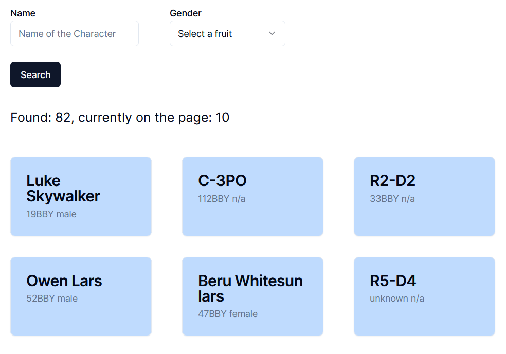
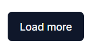
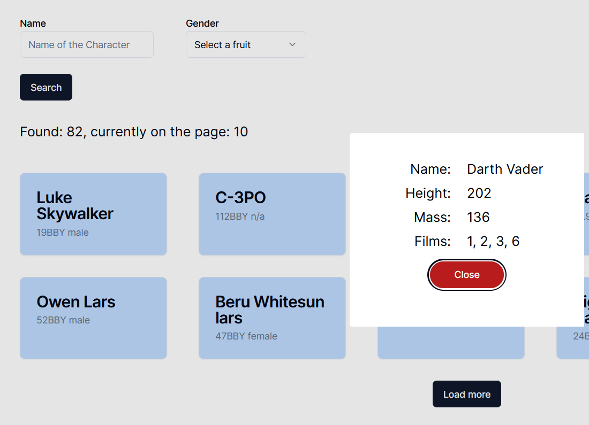
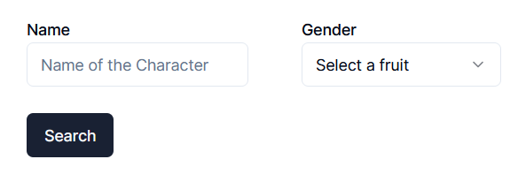

# Star Wars Wiki

---

This is a [Next.js](https://nextjs.org/) web application that uses [Swapi.dev](https://swapi.dev/) API to list Star Wars characters.
Some Components from [Shadcn](https://ui.shadcn.com/) library.

## Getting Started

First, run the development server:

### Manual

```bash
npm run dev
# or
yarn dev
# or
pnpm dev
# or
bun dev
```

### Docker

```bash
docker compose run
```

Open [http://localhost:3000](http://localhost:3000) with your browser to see the result.

## Features



Initially, the application queries the characters without any parameters.
It loads the first page, which consists of 10 characters.



Use this button to display another page of characters. 
This will appear below the previous queried characters. 
When the last page is reached, the button disappears.



Click one of the card to open additional information about the character.



You can filter by name and gender.
After filling in the form, pressing the search button will replace the previous data with the new filtering. 
If the form is blank, pressing the search button will retrieve all the unfiltered data again.

